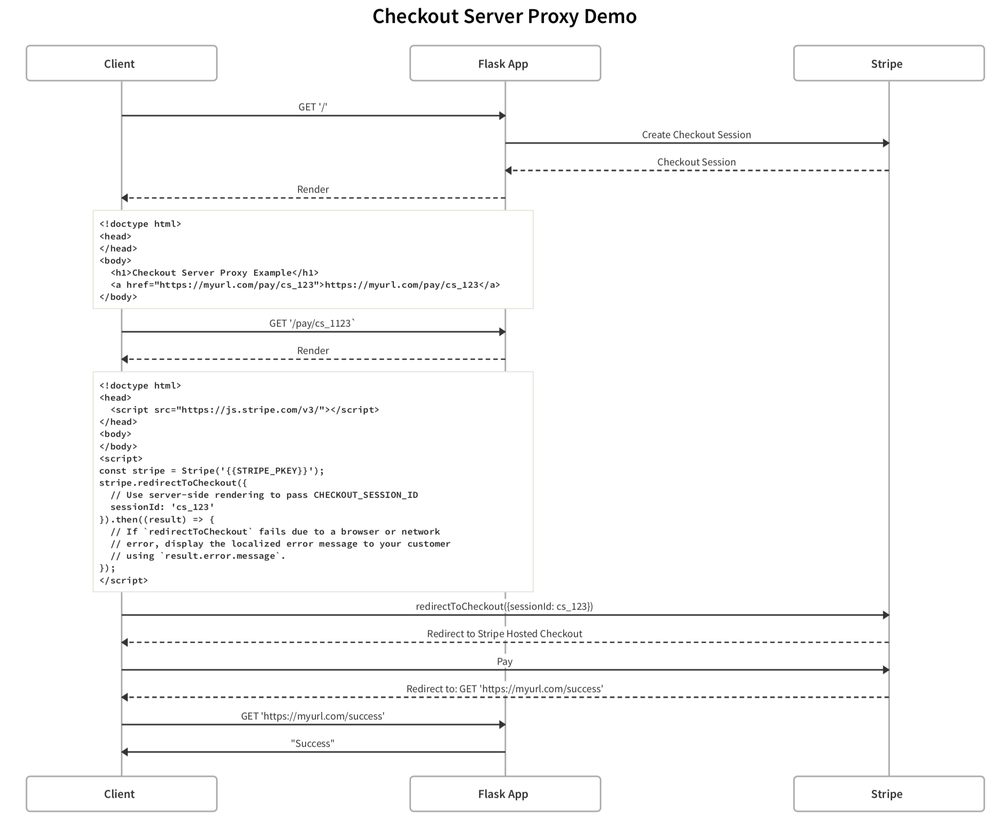

# Checkout Server Proxy Demo
An example of using Checkout Server via a Flask Proxy to simply load Stripe.js and reroute to the Checkout session.

## Setup
1. clone this repo
2. in the root directory run `pipenv install`
3. create a `.env` file in the root directory
    ```shell
    STRIPE_SKEY={{STRIPE_SECRET_KEY}}
    STRIPE_PKEY={{STRIPE_PUBLISHABLE_KEY}}
    DOMAIN={{YOUR_DOMAIN}}}
    ```
4. Run the Flask app
    ```
    $ export FLASK_APP=app.py
    $ flask run
    * Running on http://127.0.0.1:5000/
    ```

## What is happening



